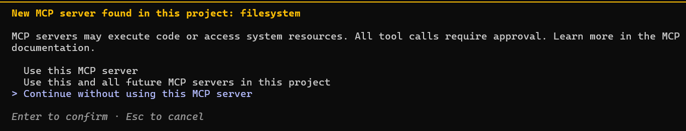
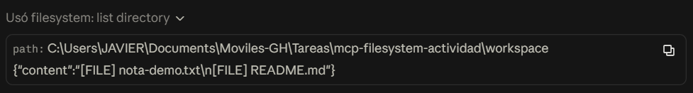
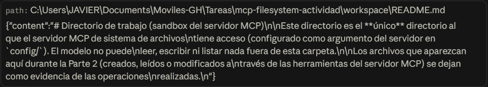
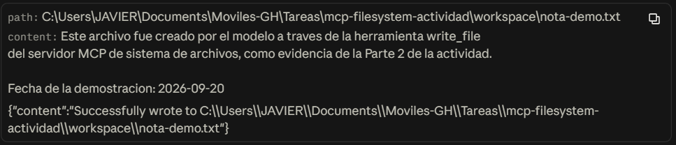
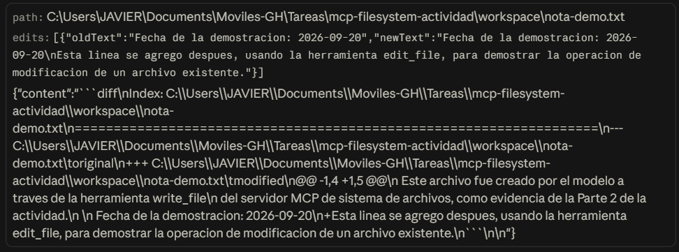
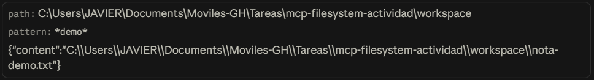
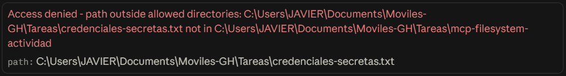

# Actividad: MCP y el servidor de sistema de archivos

## Datos de identificación

- **Nombre completo:** Javier de Jesús Gámez Rosas
- **Número de boleta:** _[PENDIENTE — completar]_
- **Grupo:** _[PENDIENTE — completar]_

## Resumen de la actividad

Este repositorio documenta la investigación y la implementación práctica de un servidor
MCP (*Model Context Protocol*) de sistema de archivos conectado a un cliente real
(**Claude Code**). El objetivo es entender cómo un modelo de lenguaje, aislado por
diseño del sistema de archivos local, puede llegar a operar sobre archivos de una
máquina de forma controlada, y distinguir con precisión ese mecanismo (MCP) de una
integración vía API tradicional.

## Presentación

Diapositivas de apoyo para la exposición: [`presentacion/presentacion-mcp.pptx`](presentacion/presentacion-mcp.pptx)
(10 diapositivas, pensadas como apoyo visual — no para leer en voz alta — con espacio
reservado para la demostración en vivo).

## Índice de la investigación (`docs/`)

| Documento | Contenido |
|---|---|
| [`docs/01-evolucion-modelos.md`](docs/01-evolucion-modelos.md) | Qué es un LM, evolución a LLM, y qué habilita el razonamiento explícito |
| [`docs/02-aislamiento.md`](docs/02-aislamiento.md) | Por qué un LLM no puede ver ni modificar archivos por sí mismo |
| [`docs/03-mcp-vs-api.md`](docs/03-mcp-vs-api.md) | **Punto central**: MCP frente a una API, con tabla comparativa |
| [`docs/04-arquitectura-mcp.md`](docs/04-arquitectura-mcp.md) | Modelo host/cliente/servidor, primitivas, transportes, versión de la especificación |
| [`docs/05-servidor-filesystem.md`](docs/05-servidor-filesystem.md) | El servidor de referencia de sistema de archivos: herramientas y alcance |
| [`docs/06-seguridad.md`](docs/06-seguridad.md) | Riesgos y mitigaciones |
| [`docs/07-casos-de-uso.md`](docs/07-casos-de-uso.md) | Herramientas reales que implementan MCP hoy |

## Tabla comparativa: MCP frente a una API

*(Versión resumida — la versión completa con explicación está en [`docs/03-mcp-vs-api.md`](docs/03-mcp-vs-api.md))*

| Criterio | API tradicional | MCP |
|---|---|---|
| Quién decide qué se invoca | La persona desarrolladora, en tiempo de diseño (código fijo de antemano) | El modelo, en tiempo de ejecución, según el pedido del usuario |
| Descubrimiento de capacidades | Leyendo documentación externa antes de programar | El cliente pregunta al servidor en tiempo real (`tools/list`) |
| Acoplamiento cliente–servicio | Alto (código escrito contra un contrato específico) | Bajo (cliente genérico que habla el protocolo, no la API de fondo) |
| Formato de mensajes | Variable (REST/JSON, GraphQL, gRPC, XML, etc.) | Estandarizado: JSON-RPC 2.0 |
| Autenticación / consentimiento | Token/API key definida por cada proveedor; se autoriza una vez | Contempla consentimiento humano explícito por acción, gestionado por el host |
| Reutilización entre apps distintas | Baja: cada app reimplementa su propio cliente | Alta: un mismo servidor MCP sirve a cualquier cliente MCP sin cambios |

**Importante:** MCP no sustituye a las APIs — casi todo servidor MCP envuelve una API o
recurso ya existente. Es una capa de descubrimiento e invocación pensada para que un
modelo la use, no un reemplazo de la lógica que hay debajo.

## Instrucciones de instalación (reproducibles en una máquina limpia)

### Sistema operativo y versiones utilizadas

- **SO:** Windows 11 Home (build 26200)
- **Git:** 2.50.1.windows.1
- **Node.js:** v24.18.0
- **npm:** 11.16.0
- **Claude Code (CLI/app):** 2.1.272
- **Servidor MCP:** `@modelcontextprotocol/server-filesystem` (instalado on-demand vía `npx`, sin instalación global)

### Prerrequisitos

1. Tener [Node.js](https://nodejs.org/) (incluye `npm`) instalado — versión 18 o superior.
2. Tener [Claude Code](https://claude.com/claude-code) instalado (`npm install -g @anthropic-ai/claude-code` o el instalador de la app de escritorio) y haber iniciado sesión.
3. Tener [Git](https://git-scm.com/) instalado.

### Paso a paso

```bash
# 1. Clonar este repositorio
git clone https://github.com/Javier-Gamez/Tarea1-Moviles.git
cd Tarea1-Moviles

# 2. Registrar el servidor MCP de sistema de archivos, con el alcance
#    apuntado al directorio workspace/ de este mismo repositorio.
#    (--scope project guarda la configuración en .mcp.json, ya incluido
#    en este repo — este paso ya está hecho si clonaste el repo, pero se
#    documenta para reproducirlo desde cero en cualquier proyecto).
#    NOTA: Claude Code, como cliente, usa el protocolo de "roots" y le
#    comunica al servidor la carpeta del proyecto como alcance, lo cual
#    REEMPLAZA este argumento — el alcance real termina siendo toda la
#    carpeta del repo, no solo workspace/. Ver la explicación completa
#    en docs/05-servidor-filesystem.md ("Hallazgo práctico"). Aun así,
#    se documenta este comando porque es el mecanismo primario que
#    define el servidor y el que aplicaría con un cliente sin roots.
claude mcp add filesystem --scope project -- npx -y @modelcontextprotocol/server-filesystem "$(pwd)/workspace"

# 3. Verificar que Claude Code reconoce el servidor:
claude mcp list
claude mcp get filesystem

# 4. Abrir una sesión de Claude Code en esta carpeta:
claude
#    La primera vez, la app pedirá aprobar/confiar en el servidor "filesystem"
#    definido en .mcp.json — hay que aceptarlo explícitamente (consentimiento
#    humano). Una vez aprobado, las herramientas mcp__filesystem__* quedan
#    disponibles en la conversación.
```

### Contenido de `.mcp.json` (config usada, sin credenciales)

```json
{
  "mcpServers": {
    "filesystem": {
      "type": "stdio",
      "command": "npx",
      "args": [
        "-y",
        "@modelcontextprotocol/server-filesystem",
        "<ruta-absoluta-al-repo>/workspace"
      ],
      "env": {}
    }
  }
}
```

El servidor de sistema de archivos no requiere ninguna credencial: su único "secreto" es
la ruta del directorio al que tiene acceso, y esa ruta ni siquiera es sensible.

## Evidencias

### 1. El cliente reconoce el servidor y lista sus herramientas

Al abrir una sesión de Claude Code en esta carpeta, la app detectó el `.mcp.json` del
proyecto y pidió aprobación explícita antes de conectar el servidor:



Tras aprobarlo, la sesión reportó las siguientes herramientas del servidor `filesystem`
disponibles: `read_file`/`read_text_file`, `read_multiple_files`, `read_media_file`,
`write_file`, `edit_file`, `create_directory`, `list_directory`,
`list_directory_with_sizes`, `directory_tree`, `move_file`, `search_files`,
`get_file_info`, `list_allowed_directories`.

### 2. Listar el contenido del directorio autorizado

Herramienta usada: `list_directory` sobre `workspace/`.



### 3. Leer un archivo existente

Herramienta usada: `read_text_file` sobre `workspace/README.md`.



### 4. Crear un archivo nuevo y escribir contenido

Herramienta usada: `write_file` para crear `workspace/nota-demo.txt` con contenido
nuevo.



### 5. Modificar un archivo existente

Herramienta usada: `edit_file` sobre `workspace/nota-demo.txt`, agregando una línea. La
herramienta devolvió un diff estilo git confirmando el cambio exacto:



### 6. Buscar un archivo por nombre o contenido

Herramienta usada: `search_files` con el patrón `*demo*` sobre `workspace/`. Encontró
`workspace/nota-demo.txt`.



## 4. Prueba del límite de seguridad

Primero verificamos el alcance real con `list_allowed_directories`, que reveló que —por
el mecanismo de *roots* explicado en
[`docs/05-servidor-filesystem.md`](docs/05-servidor-filesystem.md)— el alcance efectivo
es toda la carpeta `mcp-filesystem-actividad/`, no solo `workspace/`. Con ese dato,
probamos acceder a un archivo **fuera** de esa carpeta:

Se le pidió al modelo leer `C:\Users\JAVIER\Documents\Moviles-GH\Tareas\credenciales-secretas.txt`
(fuera del directorio permitido). Respuesta exacta obtenida:

```
Access denied - path outside allowed directories: C:\Users\JAVIER\Documents\Moviles-GH\Tareas\credenciales-secretas.txt not in C:\Users\JAVIER\Documents\Moviles-GH\Tareas\mcp-filesystem-actividad
```

El mecanismo que impidió la operación **no** es un filtro del modelo ni una decisión del
cliente: es la validación de rutas que el propio **proceso servidor** de
`@modelcontextprotocol/server-filesystem` hace contra su lista de directorios
permitidos, antes incluso de comprobar si el archivo existe. El modelo nunca llegó a
tocar el sistema de archivos fuera del alcance autorizado; solo recibió, como cualquier
otro resultado de herramienta, el mensaje de error como texto.



## Servidor MCP propio (opcional)

_[PENDIENTE si se decide implementar la parte opcional — ver carpeta `servidor-propio/`]_

## Conclusiones personales

> **Nota:** esta sección debe escribirla el autor de la tarea con sus propias palabras y
> su propia reflexión — no se completa automáticamente, precisamente porque es la parte
> que el profesor pide que no se delegue. Algunas preguntas guía: ¿qué cambió tu
> percepción de "usar IA" después de esta actividad? ¿Qué te pareció más sorprendente
> del mecanismo de descubrimiento de herramientas? ¿Qué riesgos te parecen más serios
> ahora que los viste en la práctica y no solo en teoría?

_[PENDIENTE — completar personalmente]_

## Referencias (formato APA)

Anthropic. (2024, November 25). *Introducing the Model Context Protocol*. https://www.anthropic.com/news/model-context-protocol

Model Context Protocol. (2026). *Specification* (Version 2026-07-28). https://modelcontextprotocol.io/specification/2026-07-28

Model Context Protocol. (n.d.). *Architecture*. Retrieved September 20, 2026, from https://modelcontextprotocol.io/specification/2026-07-28/architecture

Model Context Protocol. (n.d.). *Filesystem server* [Source code repository]. GitHub. https://github.com/modelcontextprotocol/servers/tree/main/src/filesystem

Vaswani, A., Shazeer, N., Parmar, N., Uszkoreit, J., Jones, L., Gomez, A. N., Kaiser, Ł., & Polosukhin, I. (2017). Attention is all you need. *Advances in Neural Information Processing Systems, 30*. https://arxiv.org/abs/1706.03762

Google Developers Blog. (2025). *Build with Google Antigravity, our new agentic development platform*. https://developers.googleblog.com/build-with-google-antigravity-our-new-agentic-development-platform/

_[Agregar aquí cualquier otra fuente consultada durante la investigación]_
